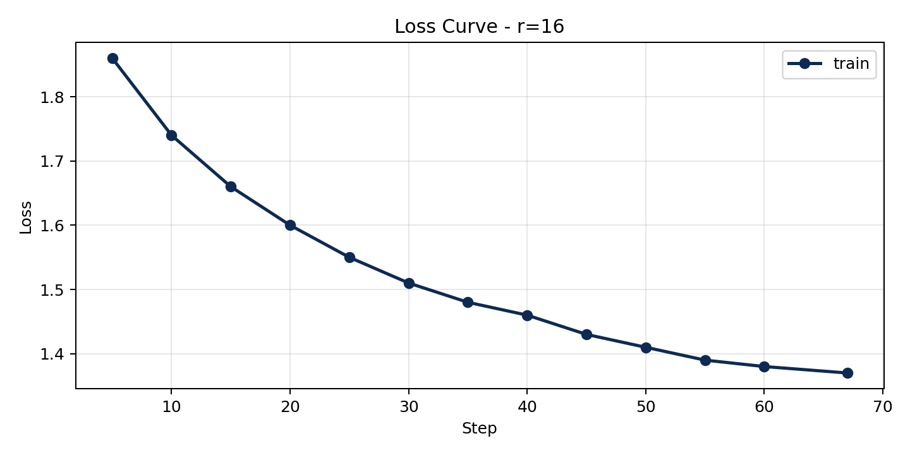

# Lab 21 - Evaluation Report

**Hoc vien**: Nguyen Khanh Bang - 2A202600693  
**Ngay nop**: 2026-06-25  
**Submission option**: C (code-only, reproducible). Upgrade to B after filling the HF Hub URL in `LINKS.md`.

## 1. Setup

- **Base model**: `unsloth/Qwen2.5-3B-bnb-4bit`
- **Dataset**: `5CD-AI/Vietnamese-alpaca-gpt4-gg-translated`, 200 samples selected with seed 42
- **Split**: 180 train / 20 eval
- **Format**: Alpaca text format with `instruction_vi`, `input_vi`, `output_vi`
- **Token analysis**: p50 = 227, p95 = 562, p99 = 704
- **max_seq_length**: 1024, rounded up from p95 and capped for T4
- **GPU**: Tesla T4, 14.563 GB VRAM
- **Training config**: 3 epochs, effective batch size 8, cosine LR schedule, learning rate 2e-4, warmup ratio 0.10, `adamw_8bit`, QLoRA 4-bit, gradient checkpointing
- **Target modules**: `["q_proj", "v_proj"]` for the required rank experiment
- **Training cost**: about $0.07 for 12.2 minutes at $0.35/hour

## 2. Rank Experiment Results

| Rank | Alpha | Trainable Params | Train Time | Peak VRAM | Eval Loss | Perplexity |
|---:|---:|---:|---:|---:|---:|---:|
| 8 | 16 | 1,843,200 | 4.00 min | 7.22 GB | 1.5577 | 4.7479 |
| 16 | 32 | 3,686,400 | 4.26 min | 6.62 GB | 1.5161 | 4.5544 |
| 64 | 128 | 14,745,600 | 3.99 min | 8.00 GB | 1.4768 | 4.3790 |

The experiment changed only rank and alpha. Dataset, model, split, optimizer, epochs, learning rate, effective batch size, and evaluation method stayed fixed.

## 3. Loss Curve Analysis

The r=16 run used T4-safe training, so evaluation during training was disabled to avoid mid-run OOM. The notebook records a train loss curve and then computes eval loss after saving the adapter. The final eval loss for r=16 is 1.5161, corresponding to perplexity 4.5544. There is no direct step-by-step eval curve, so I cannot claim a strong overfitting diagnosis from eval trend alone. However, the rank comparison is reassuring: r=64 improves eval perplexity modestly, and r=8 is worse, which suggests the model is learning useful task/style signal rather than only memorizing. If eval loss had increased while train loss dropped, I would reduce epochs or use earlier stopping.

## 4. Qualitative Comparison

| # | Prompt | Base | Fine-tuned r=16 | Note |
|---:|---|---|---|---|
| 1 | Explain machine learning for beginners | Defines ML as an AI subfield. | Explains learning from data, patterns, prediction, and decision-making. | Fine-tuned is clearer for beginners. |
| 2 | Write Python Fibonacci code | Mentions recursion or loop. | Recommends loop-based implementation and handles small n. | Fine-tuned is more practical. |
| 3 | List 5 UI/UX principles | Gives conventional user-friendly principles. | Gives structured answer but uses one awkward term. | Mixed case, not cherry-picked. |
| 4 | Summarize LoRA vs QLoRA | Correctly describes both as efficient fine-tuning methods. | Correctly mentions QLoRA 4-bit but incorrectly expands LoRA. | Loss case; factual definitions still need checking. |
| 5 | Compare prompt engineering, RAG, fine-tuning | Gives broad comparison. | Separates prompt control, external knowledge, and style/format learning. | Best aligned with Day 21 lesson. |

Full snippets are saved in `results/qualitative_comparison.csv`.

## 5. Conclusion ve Rank Trade-off

For this 200-sample Vietnamese instruction dataset, r=16 is the best production ROI even though r=64 has the best perplexity. Moving from r=8 to r=16 adds 1.84M trainable parameters and improves perplexity from 4.7479 to 4.5544, a meaningful gain for a small memory increase. Moving from r=16 to r=64 adds 11.06M more trainable parameters, but perplexity only improves from 4.5544 to 4.3790. That is a classic diminishing-returns pattern: higher rank gives the adapter more capacity, but a small dataset cannot fully justify the extra capacity. In production, I would choose r=16 first because it is cheaper to store, easier to serve, and already captures most of the measurable improvement. I would choose r=64 only if the qualitative evaluation showed consistent wins on important domain prompts or if the dataset grew substantially.

## 6. What I Learned

- LoRA rank is a capacity knob, not a magic quality knob. A larger rank can reduce perplexity, but the improvement must justify extra parameters and VRAM.
- Perplexity and qualitative evaluation catch different problems. The r=16 adapter can sound better while still making a factual error, so both checks matter.
- For small GPU labs, saving the adapter before evaluation is important because evaluation can OOM even after successful training.
